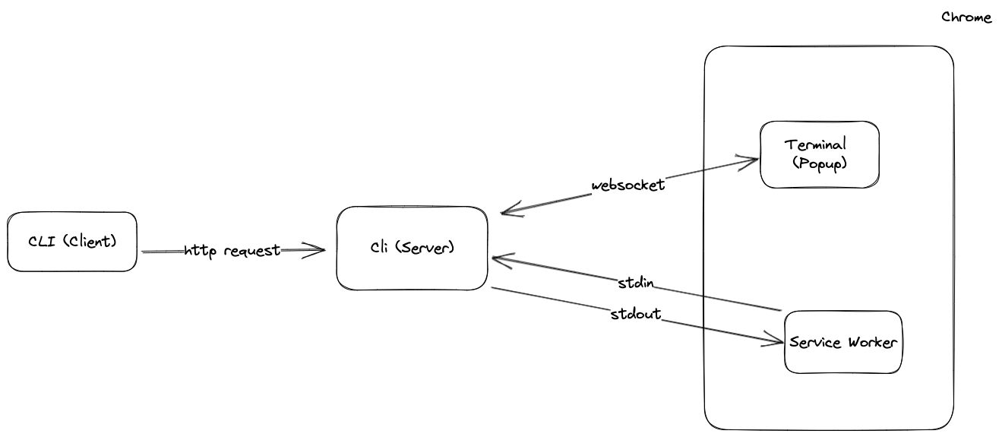

# popcorn

An integrated terminal for your browser.

Check out a demo of the extension running from the arc browser here: <https://www.capster.io/video/zRgddaTPilyn>.

## Installation

> **Warning**: popcorn does not work on Windows yet (see [this issue](https://github.com/creack/pty/issues/161)).

Install the popcorn binary (or download it from the [releases page](https://github.com/pomdtr/popcorn/releases/latest)):

```bash
# Using brew
brew install pomdtr/tap/popcorn

# From source
go install github.com/pomdtr/popcorn@latest
```

Download the extension from the [releases page](https://github.com/pomdtr/popcorn/releases/latest) and unzip it.

Then go to the `chrome://extensions` page, activate the Developer mode and click on the `Load unpacked` button.
You will need to select the `dist` folder you just extracted using the file picker.

Once you have installed the extension, copy the extension id, and run the following command:

```bash
popcorn init <extension-id>
```

Alternatively, you can right click on the extension icon and select `Copy Installation Command`.

## Usage

Click on the extension icon to open your default profile in a new tab.

Right click on the extension icon to open a new tab with a specific profile.
Each profile gets it's own unique url, so you can bookmark them.

From the terminal tab, you can manipulate your browser tabs, windows, bookmarks, etc...

```sh
popcorn tab list
```

## Configuration

The configuration file is located in `~/.config/popcorn/popcorn.json` or `~/.config/popcorn/popcorn.jsonc` if you want to use comments.

You can customize the configuration dir by setting the `XDG_CONFIG_HOME` environment variable.

Example Config:

```json
{
    "theme": "Tomorrow",
    "themeDark": "Tomorrow Night",
    "defaultProfile": "zsh",
    "profiles": {
        "zsh": {
            "command": "zsh",
            "args": ["-l"]
        },
        "htop": {
            "command": "/opt/homebrew/bin/htop"
        }
    }
}
```

## How does it work?

popcorn is composed of two parts:

- A CLI (popcorn) that will create a configuration file and a binary that will be used by the extension.
- A Chrome extension that will communicate with the binary and display the terminal.

When the chrome extension is loaded, it will use the native messaging API to communicate with the host binary.
An instance of an HTTP server will be started on a random free http port.

The embedded terminal (xterm.js) will connect to the HTTP server and will be able to send and receive data through a websocket.

When you use the popcorn cli, the message is sent to the http server, and then piped to the chrome extension.


