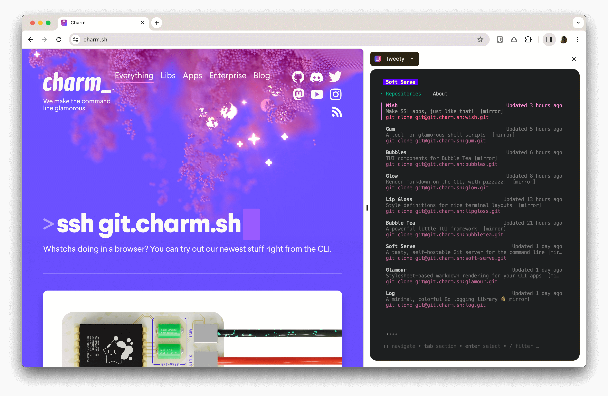
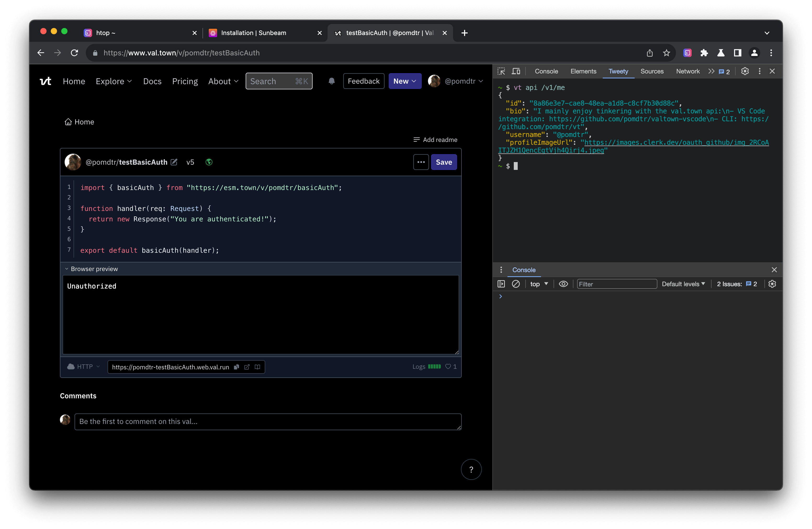

# Tweety - An Integrated Terminal for your Browser

Minimize your context switching by interacting with your terminal directly from your browser.

## Features

### Mix Web and Terminal tabs


### Side by side mode



### Developer-Console Integration



## Installation

```sh
brew install pomdtr/tap/tweety
go install github.com/pomdtr/tweety@latest
```

or download a binary from [releases](https://github.com/pomdtr/tweety/releases).

See the `tweety completions` command to generate completion scripts for your shell.

## Usage

```sh
tweety [-p <port>]
```

By default, tweety will start on port 9999, so you can access it at <http://localhost:9999>.

If you prefer to use a browser friendly URL, you can go to `https://local.tweety.sh` instead.
The page will access Tweety on port 9999.

> Note: Browser Friendly urls are not available on Safari, and requires to disable the Shield feature on Brave.

## Chrome Extension

A chrome extension is availaible in the extension folder. To install it:

- Clone the repository
- Go to `chrome://extensions`
- Enable `Developer mode`
- Click on `Load unpacked`
- Select the `extension` folder

By default, the extension will try to connect to `localhost:9999`. You can
customize the origin in the extension options.

You can also configure the extension to start Tweety automatically when your browser starts. In order to do that, you need to tell your browser how to start Tweety. This is achieved by putting a manifest file in a specific location using the `tweety manifest` command.

```sh
# ex for chrome on MacOS
# the extension id can be found in chrome://extensions
tweety manifest --extension-id=<extension-id> > ~/Application\ Support/Google/Chrome/NativeMessagingHosts/com.pomdtr.tweety.json
```

The next time you start your browser, Tweety will be started automatically on port 9999.

> Warning: Arc Browser Native Messaging is buggy right now, so you probably want to use the [Start Tweety on boot](#starting-tweety-on-boot) method instead.

## Starting Tweety on boot

### MacOS

```sh
tweety service > ~/Library/LaunchAgents/com.pomdtr.tweety.plist
launchctl load ~/Library/LaunchAgents/com.pomdtr.tweety.plist
```

### Linux

TODO

## Configuration

Use the `$XDG_CONFIG_DIR/tweety/tweety.json` file to configure Tweety (defaults
to `~/.config/tweety/tweety.json`).

Alternatively, you can use the `TWEETY_CONFIG` environment variable to specify a
custom path.

```json
{
  "$schema": "https://github.com/pomdtr/tweety/releases/latest/download/config.schema.json",
  "theme": "Tomorrow",
  "themeDark": "Tomorrow Night",
  "env": {
    "EDITOR": "kak"
  },
  "defaultProfile": "default",
  "profiles": {
    "default": {
      "command": "bash",
      "args": ["--login"],
      "env": {
        "EDITOR": "vim"
      }
    },
    "fish": {
      "command": "fish",
      "args": ["--login"],
      "favicon": "https://fishshell.com/favicon.ico"
    }
  }
}
```

## Endpoints

- `/` - open the default profile
- `/?reload=true` - reload the page when the command exits
- `/?profile=<profile>` - open a specific profile

## FAQ

### Firefox version?

Firefox should be quite easy to support, the browser integration is minimal. Contributions are welcome!
