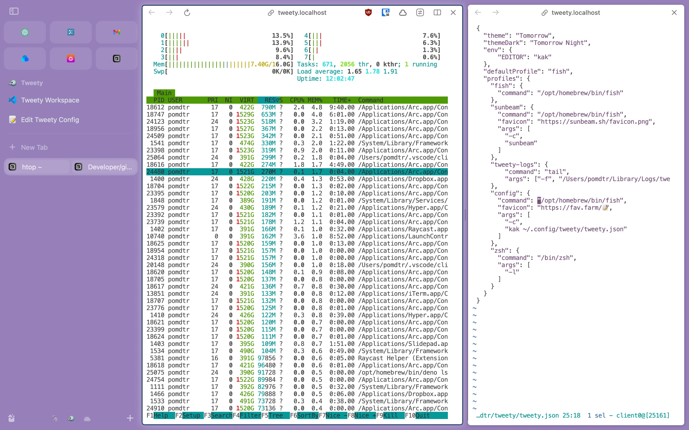

# Tweety

An integrated terminal for your browser.



## Usage

```
tweety [-H <host>] [-p <port>]
```

## Installation

```
brew install pomdtr/tap/tweety
go install github.com/pomdtr/tweety@latest
```

or download a binary from [releases](https://github.com/pomdtr/tweety/releases).

## Configuration

Use the `$XDG_CONFIG_DIR/tweety/tweety.json` file to configure Tweety (defaults
to `~/.config/tweety/tweety.json`).

Alternatively, you can use the `TWEETY_CONFIG` environment variable to specify a
custom path.

```json
{
  "$schema": "https://github.com/pomdtr/tweety/releases/latest/download/config.schema.json",
  "theme": "Tomorrow",
  "themeDark": "Tomorrow Night",
  "env": {
    "EDITOR": "kak"
  },
  "defaultProfile": "default",
  "profiles": {
    "default": {
      "shell": "bash",
      "args": ["--login"],
      "env": {
        "EDITOR": "vim"
      }
    },
    "fish": {
      "shell": "fish",
      "args": ["--login"]
    }
  }
}
```

## Endpoints

- `/` - Open Default Profile
- `/p/<profile>` - Open Profile
- `/config` - View Configuration
