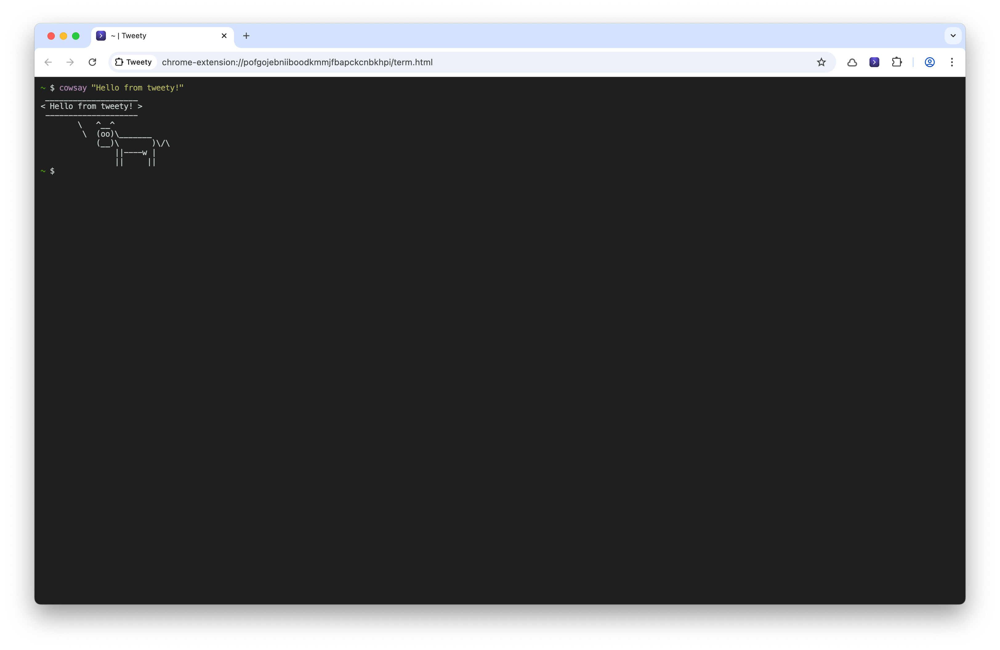
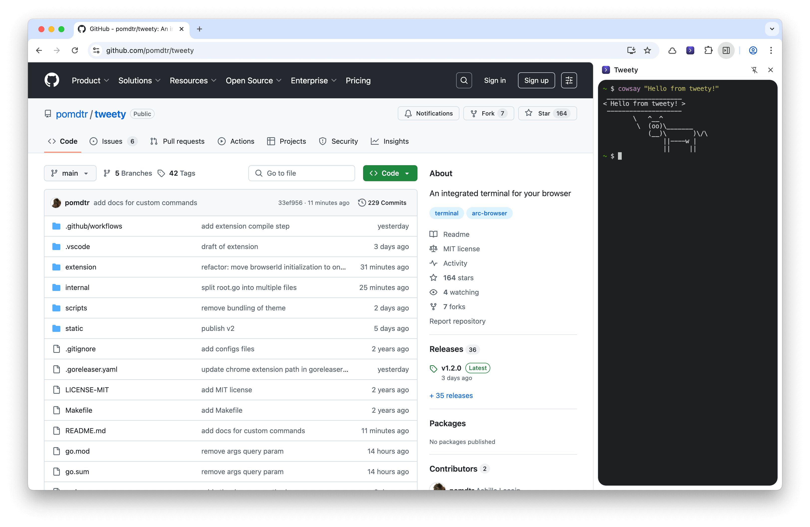
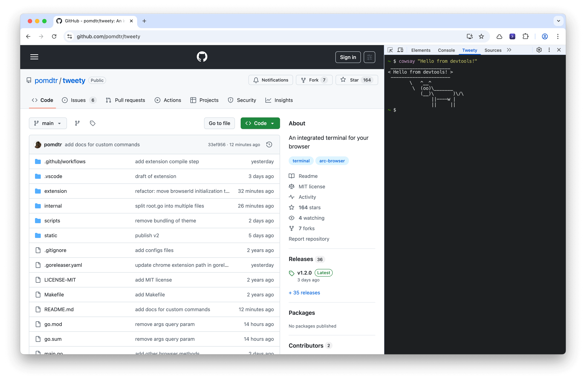
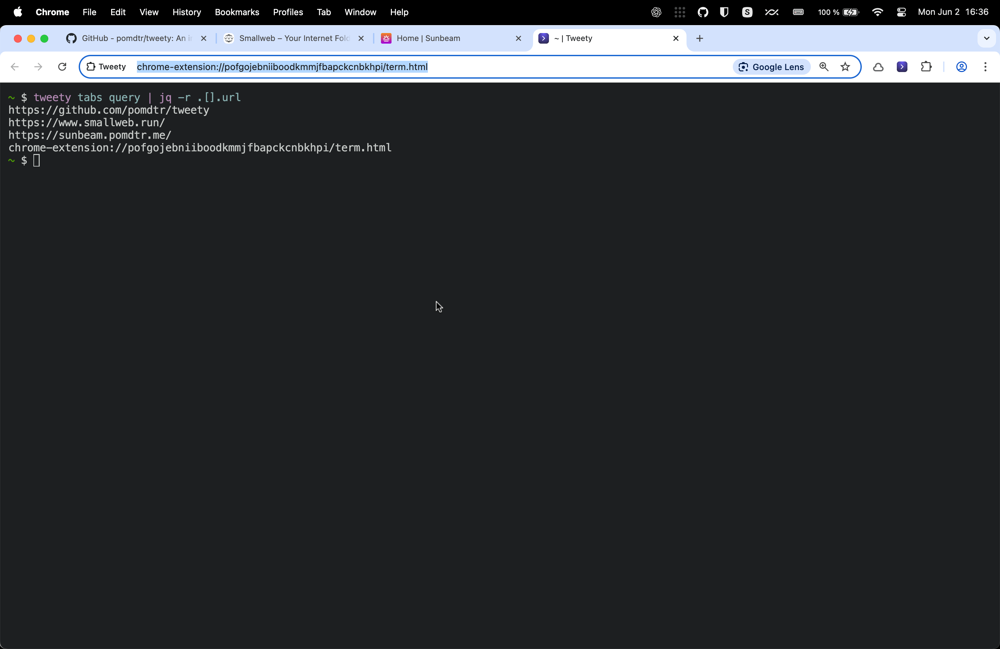

# Tweety - An Integrated Terminal for your Browser

Minimize your context switching by interacting with your terminal directly from your browser.

## Features

### Terminal Tabs



### Side Panel



### Devtools Integration



### Scripting using the Chrome Extension API



## Installation

### Chrome Extension

Download the extension zip from the [releases](https://github.com/pomdtr/tweety/release).

Unzip the file and open Chrome. Go to `chrome://extensions/`, enable "Developer mode" and click on "Load unpacked". Select the unzipped folder.

You'll get an error the first time you load the extension, because the native host is not installed yet. You can ignore this error for now.

### Golang Binary

Tweety is available on macOS, Linux.

```sh
# Homebrew (recommended)
brew install pomdtr/tap/tweety
```

or download a binary from [releases](https://github.com/pomdtr/tweety/releases).

To allow the extension to communicate with the native host, you'll need to run the following command:

```sh
tweety install --extension-id <extension-id>
```

You can find the extension ID in the Chrome extensions page (`chrome://extensions/`), it should look like `pofgojebniiboodkmmjfbapckcnbkhpi`.

## Usage

Click on the extension icon in your browser toolbar to open a new terminal.

### `tweety` command

Use the `tweety` command to create new terminal tabs, or interact with the chrome extension API.

Make sure to setup the completions using the `tweety completion` command.

### Custom Commands

You can register custom subcommands for the `tweety` cli by creating executables in the `~/.config/tweety/commands` directory. Each executable should be a single file and will be available as `tweety <command-name>`.

For example, you can create `~/.config/tweety/commands/copy-markdown-link.sh` with the following content:

```sh
#!/bin/sh

CURRENT_TAB=$(tweety tabs get)
URL=$(echo "$CURRENT_TAB" | jq -r .url)
TITLE=$(echo "$CURRENT_TAB" | jq -r .title)

printf "[%s](%s)" "$TITLE" "$URL" | pbcopy
```

Then invoke it with `tweety copy-markdown-link` to copy the current tab's title and URL as a markdown link to your clipboard.


### Apps

You can create new apps by adding executables to the `~/.config/tweety/apps` directory. Each app should be a single executable file.

Each app is accessible at `chrome-extensions://<extension-id>/term.html?mode=app&app=<app-name>`, where `<app-name>` is the name of the executable file.

For example, I can create a file `~/.config/tweety/apps/htop.sh` with the following content:

```sh
#!/bin/sh

exec /opt/homebrew/bin/htop
```

And access it at `chrome-extensions://pofgojebniiboodkmmjfbapckcnbkhpi/term.html?mode=app&app=htop` or open it in a new tab using the `tweety run htop` command.

### Configuration

```jsonc
// ~/.config/tweety/config.json
{
    "command": "/opt/homebrew/bin/fish", // The command to run in the terminal
    "args": [
        "--login" // Arguments to pass to the command
    ],
    "env": {
        // Environment variables to set in the terminal
    },
    "xterm": {
        // Xterm.js configuration (see https://xtermjs.org/docs/api/terminal/interfaces/iterminaloptions/)
        "fontSize": 14,
        "cursorBlink": false
    },
    "theme": "Tomorrow", // The theme to use for the terminal
    "themeDark": "Tomorrow Night" // The theme to use for the terminal in dark mode
}
```

You can find out the available themes by checking the `internal/cmd/themes` folder. The theme name corresponds to the name of the file without the `.json` extension.
