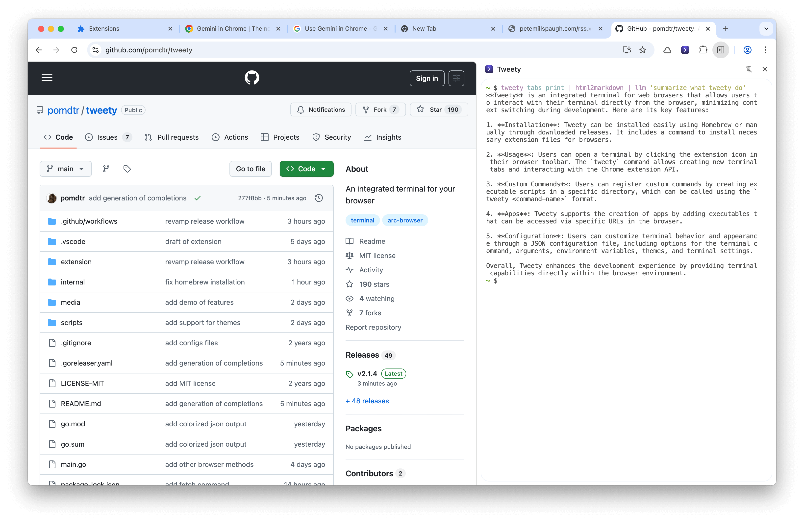

# Tweety - An Integrated Terminal for your Browser



## Features

- terminal tabs
- terminal panel in devtools
- terminal popup
- forward the chrome extension API to your shell
- bookmark commands

## Installation

Tweety is not distributed through the Chrome Web Store, as I don't think it would pass the review process. Instead, you can install it manually or using Homebrew.

### Using [Homebrew](https://brew.sh/) (recommended)

First install the `tweety` cli, and the extension manifest:

```sh
brew install pomdtr/tap/tweety
tweety install manifest
```

Then, install the browser extension:

- If you're using chrome:

    1. Go to `chrome://extensions/` in your browser.
    1. Enable "Developer mode" in the top right corner.
    1. Click on "Load unpacked".
    1. Select the `/opt/homebrew/share/tweety/extensions/chrome` on macOS or `/home/linuxbrew/.linuxbrew/share/tweety/extensions/chrome` on Linux.

- If you're using firefox developer edition or the zen browser:

    1. Go to `about:config` in your browser.
    2. Set `xpinstall.signatures.required` to `false`.
    3. Go to `about:addons`
    4. Click on the gear icon in the top right corner and select "Install Add-on From File...".
    5. Select the `firefox.zip` file located in `/opt/homebrew/share/tweety/extensions/firefox` on macOS or `/home/linuxbrew/.linuxbrew/share/tweety/extensions/firefox` on Linux.

You can upgrade tweety using `brew update && brew upgrade tweety`.

- On chrome, you can also click on the "Reload" button in the extensions page to reload the extension after upgrading.
- On firefox, you'll need to remove, then re-install the extension after upgrading.

### Manual Installation

You can also install the extension manually by downloading the latest release from the [releases page](https://github.com/pomdtr/tweety/releases) and extracting it to a directory of your choice.

You'll find the extension assets in the `extensions` directory of the extracted archive. You can then load the extension in your browser as described above.

## Usage

Click on the extension icon in your browser toolbar to open a new terminal.

### `tweety` command

Use the `tweety` command to create new terminal tabs, or interact with the chrome extension API.

Make sure to setup the completions using the `tweety completion` command.

### Custom Commands

You can register custom subcommands for the `tweety` cli by creating executables in the `~/.config/tweety/commands` directory. Each executable should be a single file and will be available as `tweety <command-name>`.

For example, you can create `~/.config/tweety/commands/copy-markdown-link.sh` with the following content:

```sh
#!/bin/sh

CURRENT_TAB=$(tweety tabs get)
URL=$(echo "$CURRENT_TAB" | jq -r .url)
TITLE=$(echo "$CURRENT_TAB" | jq -r .title)

printf "[%s](%s)" "$TITLE" "$URL" | pbcopy
```

Then invoke it with `tweety copy-markdown-link` to copy the current tab's title and URL as a markdown link to your clipboard.

### Apps

You can create new apps by adding executables to the `~/.config/tweety/apps` directory. Each app should be a single executable file.

Each app is accessible at `chrome-extensions://<extension-id>/term.html?mode=app&app=<app-name>`, where `<app-name>` is the name of the executable file.

For example, I can create a file `~/.config/tweety/apps/htop.sh` with the following content:

```sh
#!/bin/sh

exec /opt/homebrew/bin/htop
```

And access it at `chrome-extensions://pofgojebniiboodkmmjfbapckcnbkhpi/term.html?mode=app&app=htop` or open it in a new tab using the `tweety run htop` command.

### Configuration

```jsonc
// ~/.config/tweety/config.json
{
    "command": "/opt/homebrew/bin/fish", // The command to run in the terminal
    "args": [
        "--login" // Arguments to pass to the command
    ],
    "env": {
        // Environment variables to set in the terminal
    },
    "xterm": {
        // Xterm.js configuration (see https://xtermjs.org/docs/api/terminal/interfaces/iterminaloptions/)
        "fontSize": 14,
        "cursorBlink": false
    },
    "theme": "Tomorrow", // The theme to use for the terminal
    "themeDark": "Tomorrow Night" // The theme to use for the terminal in dark mode
}
```

You can find out the available themes by checking the `internal/cmd/themes` folder. The theme name corresponds to the name of the file without the `.json` extension.
