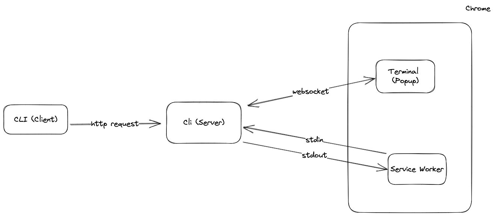

# WebTerm

An integrated terminal for your browser.


## Installation

> **Warning**: WebTerm does not work on Windows yet (see [this issue](https://github.com/creack/pty/issues/161)).

```bash
# clone the repository
git clone https://github.com/pomdtr/webterm && cd webterm

# install the cli
go install
webterm init

# build the extension
cd extension
npm i
npm run build
```

Then go to the `chrome://extensions` page, activate the Developer mode and click on the `Load unpacked`.

You will need to select the `extension/dist` folder using the file picker.

## How does it work?

WebTerm is composed of two parts:

- A CLI that will create a configuration file and a binary that will be used by the extension.
- A Chrome extension that will communicate with the binary and display the terminal.

When the chrome extension is loaded, it will use the native messaging API to communicate with the host binary.
An instance of an HTTP server will be started on the 9999 port.

When the popup is opened, the embedded terminal (xterm.js) will connect to the HTTP server and will be able to send and receive data through a websocket.

When you use the webterm cli, the message is sent to the http server, and then piped to the chrome extension.


