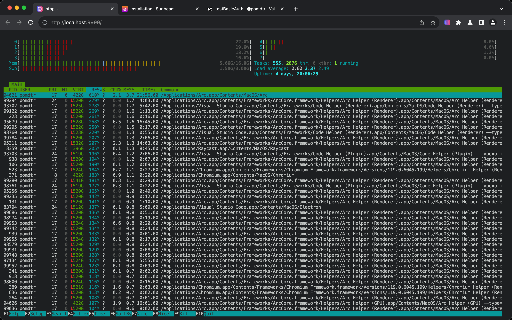

# Tweety - An Integrated Terminal for your Browser

Minimize your context switching by interacting with your terminal directly from your browser.



## Installation

### Chrome Extension

Download the extension zip from the [releases](https://github.com/pomdtr/tweety/release).

Unzip the file and open Chrome. Go to `chrome://extensions/`, enable "Developer mode" and click on "Load unpacked". Select the unzipped folder.

You'll get an error the first time you load the extension, because the native host is not installed yet. You can ignore this error for now.

### Golang Binary

Tweety is available on macOS, Linux.

```sh
# Homebrew (recommended)
brew install pomdtr/tap/tweety
```

or download a binary from [releases](https://github.com/pomdtr/tweety/releases).

To allow the extension to communicate with the native host, you'll need to run the following command:

```sh
tweety install --extension-id <extension-id>
```

You can find the extension ID in the Chrome extensions page (`chrome://extensions/`), it should look like `pofgojebniiboodkmmjfbapckcnbkhpi`.

## Usage

Start by creating a new config file at `~/.config/tweety/config.json` with the following content:

```json
{
    "command": "/bin/zsh"
}
```

Click on the Tweety icon in your browser toolbar, and it will open a new tab with the terminal running in it.

You can access the chrome extension api from the shell using the `tweety` command. For example, to list the opened tabs, you can run `tweety tabs query` (which maps to the `chrome.tabs.query` method).

## Config Properties

```jsonc
{
    "command": "/bin/zsh", // The command to run in the terminal
    "env": {
        // Environment variables to set in the terminal
        "PATH": "/usr/local/bin:/usr/bin:/bin"
    },
    "xterm": {
        // Xterm.js configuration (see https://xtermjs.org/docs/api/terminal/interfaces/iterminaloptions/)
        "fontSize": 14,
        "cursorBlink": false
    }
}
```
