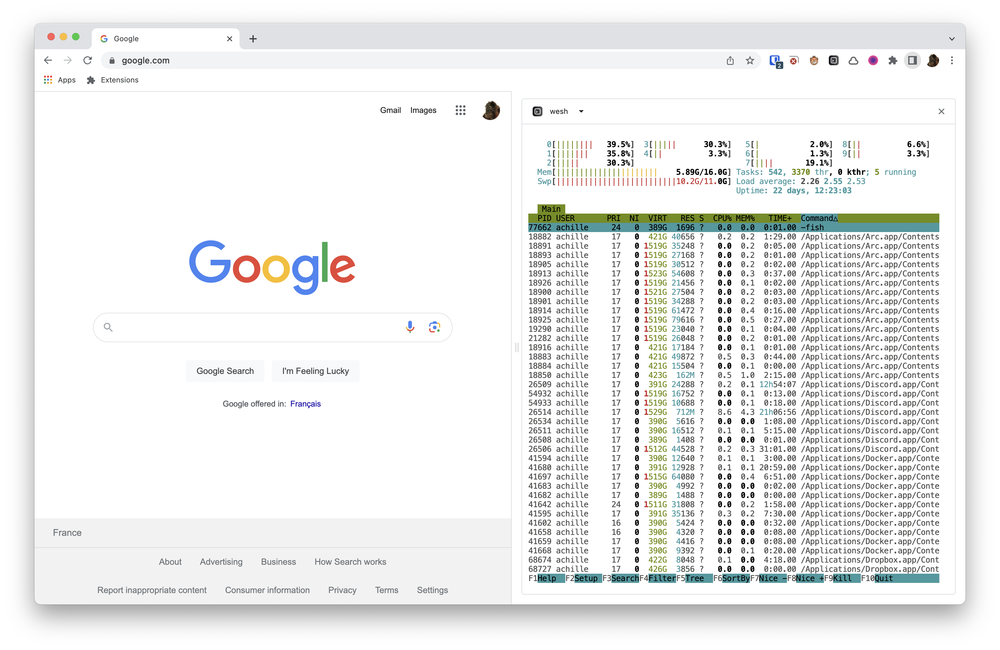

# popcorn

An integrated terminal for your browser.



Check out a demo of the extension running from the arc browser here: <https://www.capster.io/video/zRgddaTPilyn>.

## Installation

> **Warning**: popcorn does not work on Windows yet (see [this issue](https://github.com/creack/pty/issues/161)).

Install the popcorn binary (or download it from the [releases page](https://github.com/pomdtr/popcorn/releases/latest)):

```bash
# Using brew
brew install pomdtr/tap/popcorn

# From source
go install github.com/pomdtr/popcorn@latest
```

Download the extension from the [releases page](https://github.com/pomdtr/popcorn/releases/latest) and unzip it.

Then go to the `chrome://extensions` page, activate the Developer mode and click on the `Load unpacked` button.
You will need to select the `dist` folder you just extracted using the file picker.


Once you have installed the extension, copy the extension id, and run the following command:

```bash
popcorn init --browser chrome --extension-id <extension-id>
```

## Usage

## CLI

You can use the wesh cli to control your browser from the command line.
It will only work from a terminal started from the extension.

## How does it work?

popcorn is composed of two parts:

- A CLI (popcorn) that will create a configuration file and a binary that will be used by the extension.
- A Chrome extension that will communicate with the binary and display the terminal.

When the chrome extension is loaded, it will use the native messaging API to communicate with the host binary.
An instance of an HTTP server will be started on a random free http port.

When the popup is opened, the embedded terminal (xterm.js) will connect to the HTTP server and will be able to send and receive data through a websocket.

When you use the popcorn cli, the message is sent to the http server, and then piped to the chrome extension.


